# Test
Three PPO policies were trained for comparison.
- single-camera input (looking up)
- multi-camera fusion (looking up, looking forward, and looking backward)
- force-vision fusion (one camera looking up and a force sensor at the joint of the sidebar)

**Camera perspectives**

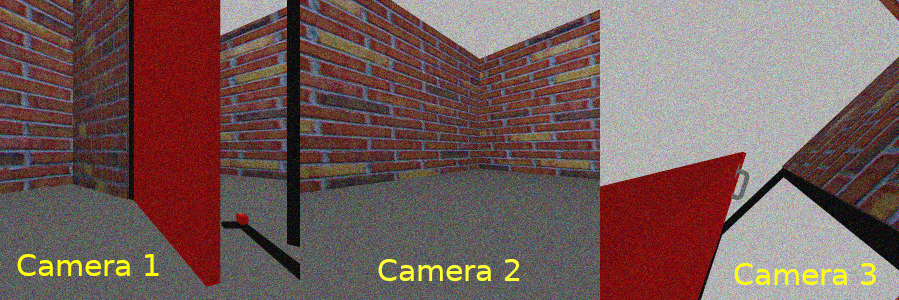

**Reward function** (same for all three policies)
- if success, reward = 100
- else if fail ,reward = -10
- else *reward = 10*delta_door_angle - step_penalty - force_penalty*, where step_penalty is 0.1, force_penalty is 1 when detected force exceeds 70 N, otherwise 0.

## Summary  
### training performance
The training performance (episodic total reward)

Conclusion: vision-force sensor fusion > multiple cameras > single camera

### policy evaluation (in the environment for training)
| \ | success rate | average steps | average max-force (N) | least step case trajectory cost (robot+sidebar) (m) |
| :----: | :----: | :----: | :----: | :----: |
| single camera input | 100% | 16 (13-20) | 148 (30 - 463) | 0.835 + 1.247 |
| multi-camera fusion | 98% |13 (10-47) | 191 (19 - 756) | 0.893 + 1.108 |
| force-vision fusion | 100% |11 (10-13) | 182 (26-826) | 0.571 + 1.015 |

### policy generalization
Success rates of different policies applied in different environments
| \ | env-0 | env-1 | env-2 | env-3 | env-4 | env-5 |
| :----: | :----: | :----: | :----: | :----: | :----: | :----: |
| single camera input | 100% | 55% | 20% | 7% | 5% | 0% |
| multi-camera fusion | 98% | 93% | 11% | 73% | 42% | 0% |
| force-vision fusion | 100% | 98% | 100% | 100% | 83% | 53% |

Environments
- env-0: same settings as the environment for training
- env-1: different settings in door color, door frame color, wall color, lighting condition
- env-2: different settings in door color, door frame color, wall color, lighting condition, wheel-ground friction coefficients, door hinge spring force
- env-3: different settings in door width, door color, door frame color, wall color, lighting condition, wheel-ground friction coefficients
- env-4: different settings in door width, door color, door frame color, door handle color, wall color, lighting condition, wheel-ground friction coefficients, door hinge spring force
- env-5: env-2 with changing wheel-ground **friction coefficients** and adding **camera noise** (Gaussian noise with variance of 0.02)   

## Environments and Statistics
### env 0 - training environment
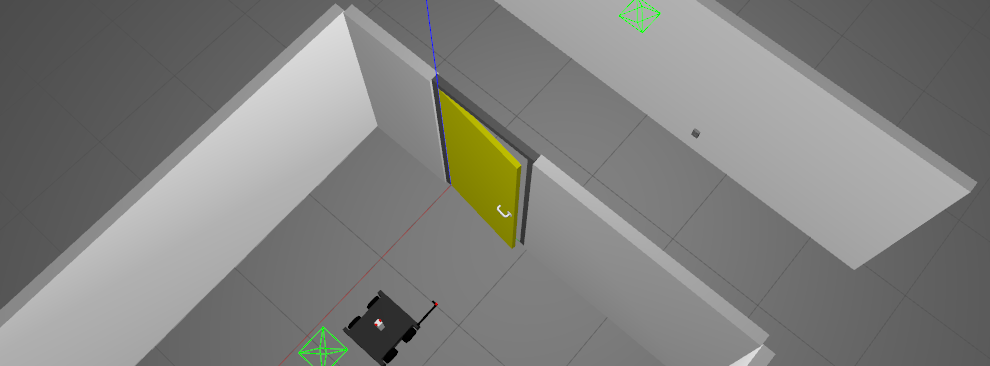
100 test cases with random initial pose of the mobile robot

**Environment Settings**
- door:
  - mass: 10kg
  - width: 0.9m
  - thickness: 4.5cm
  - height: 2.1m
  - color: yellow
- door hinge:
  - spring reference: 2 (number of spring)
  - spring stiffness: 1
- door frame:
  - color: gray
- door handle:
  - color: white
- wall:
  - color: white
- lighting:
  - one in room: constant = 1
  - one out room: constant = 0.5
- wheel-ground friction: mu1=0.98, mu2=0.98
- camera noise: 0.00

**Test Statistics**
- *single camera*
  - **success rate: 100 / 100**
  - failure case []
  - steps: average **16**, minimum 13 [85], maximum 20 [55]
  - average value: average **97.213**, lowest 84.022 [85], highest 100.905 [57]
  - max force: average 148.215, smallest 30.342 [86] largest 463.159 [78]
  - trajectory of the case with least step  
  
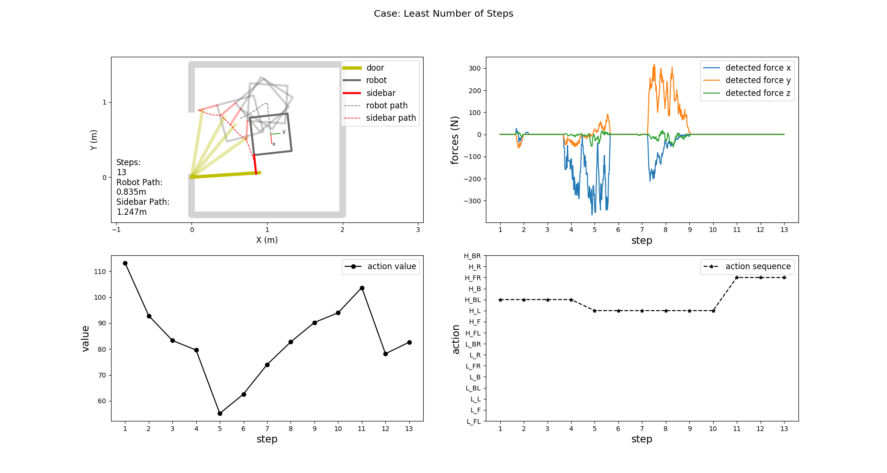
- *multiple cameras*
  - **success rate: 98 / 100**
  - failure case [35,60]
  - steps: average **13**, minimum 10 [25], maximum 47 [96]
  - average value: average **97.332**, lowest 86.985 [63], highest 100.153 [95]
  - max force: average 191.523, smallest 19.581 [60] largest 756.482 [57]
  - trajectory of the case with least step  

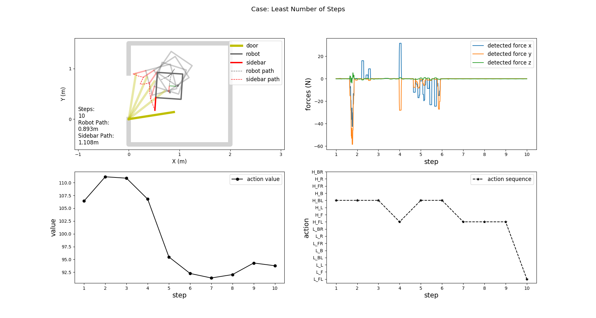
- *force-vision sensor fusion*   
  - **success rate: 100 / 100**
  - failure case []
  - steps: average **11**, minimum 10 [6], maximum 13 [8]
  - average value: average **94.978**, lowest 85.984 [97], highest 96.888 [59]
  - max force: average 182.153, smallest 25.967 [91] largest 826.050 [48]
  - trajectory of the case with least step  

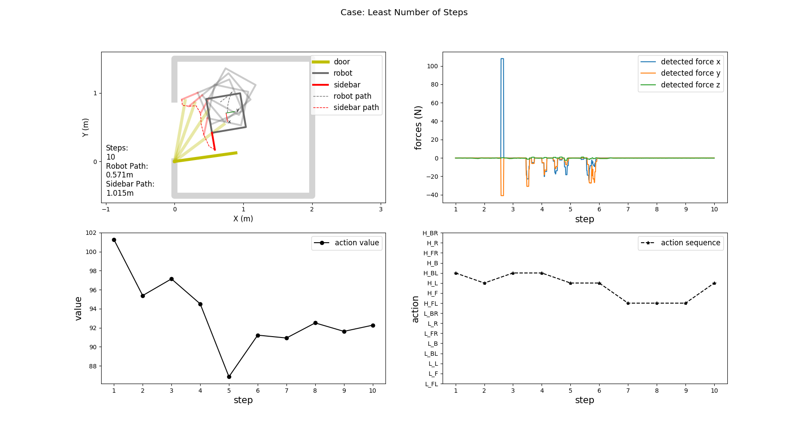

### env 1
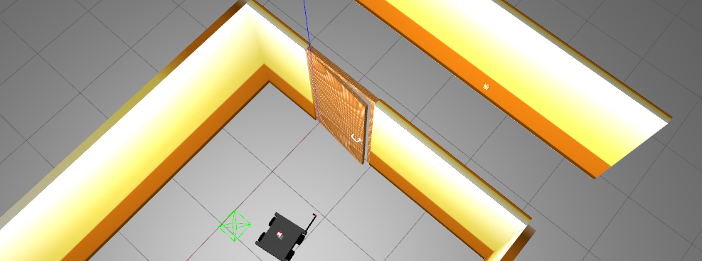
100 test cases with random initial pose of the mobile robot

**Environment Settings**
- door:
  - mass: 10kg
  - width: 0.9m
  - thickness: 4.5cm
  - height: 2.1m
  - color: **wood**
- door hinge:
  - spring reference: 2 (number of spring)
  - spring stiffness: 1
- door frame:
  - color: wood
- door handle:
  - color: white
- wall:
  - color: **painted wall**
- **lighting**:
  - one in room: constant = 0.2
- wheel-ground friction: mu1=0.98, mu2=0.98
- camera noise: 0.00

**Test Statistics**
- *single camera*
  - **success rate: 55 / 100**
  - failure case [1, 2, 4, 5, 6, 7, 10, 11, 13, 14, 16, 17, 19, 20, 22, 23, 25, 27, 29, 30, 32, 33, 34, 37, 47, 50, 51, 54, 58, 59, 62, 63, 64, 65, 67, 68, 73, 78, 81, 82, 88, 92, 94, 95, 97]
  - steps: average **17**, minimum 14 [16], maximum 28 [19]
  - average value: average **63.274**, lowest 47.699 [18], highest 76.013 [16]
  - max force: average 282.924, smallest 195.541 [50] largest 427.336 [5]
  - trajectory of the case with least step  

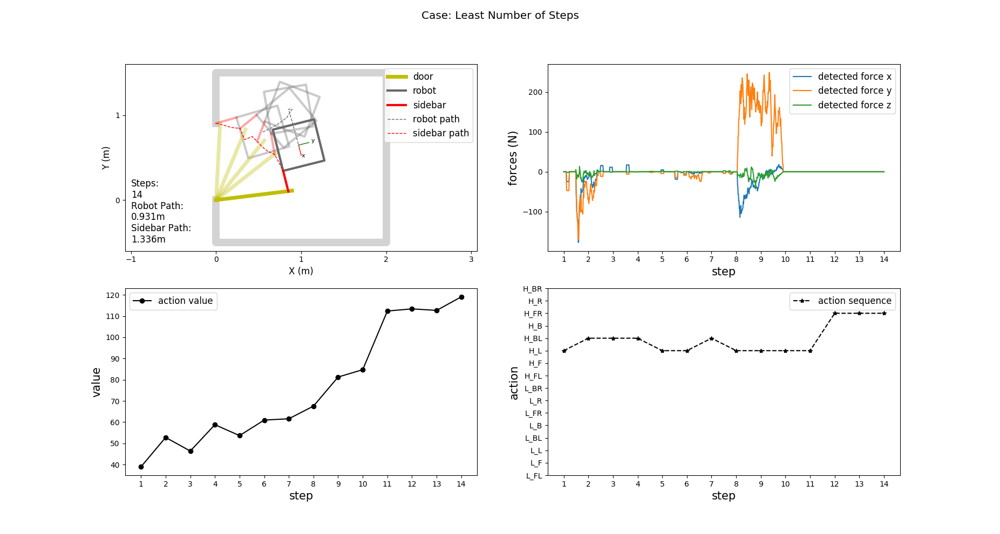
- *multiple cameras*
  - **success rate: 93 / 100**
  - failure case [6,17,32,42,45,60,66]
  - steps: average **14**, minimum 11 [5], maximum 35 [11]
  - average value: average **121.757**, lowest 105.400 [11], highest 131.029 [23]
  - max force: average 289.416, smallest 24.736 [56] largest 835.247 [83]
  - trajectory of the case with least step  

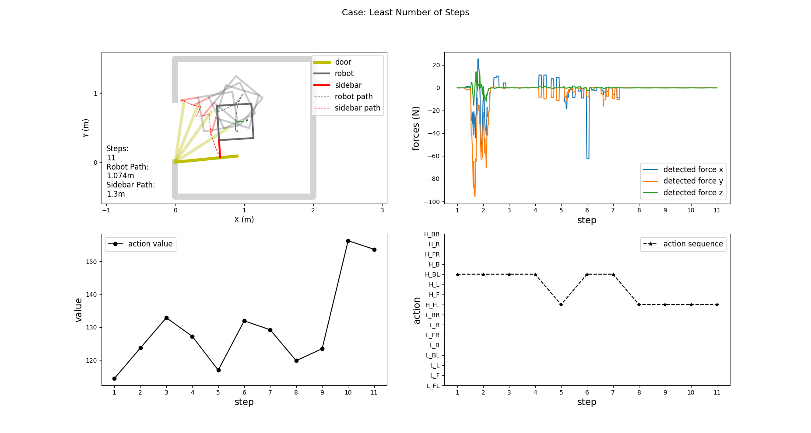
- *force-vision sensor fusion*   
  - **success rate: 98 / 100**
  - failure case [86,97]
  - steps: average **12**, minimum 11 [6], maximum 14 [37]
  - average value: average **96.093**, lowest 88.525 [8], highest 105.453 [94]
  - max force: average 213.772, smallest 83.557 [94] largest 705.967 [18]
  - trajectory of the case with least step  

### env 2
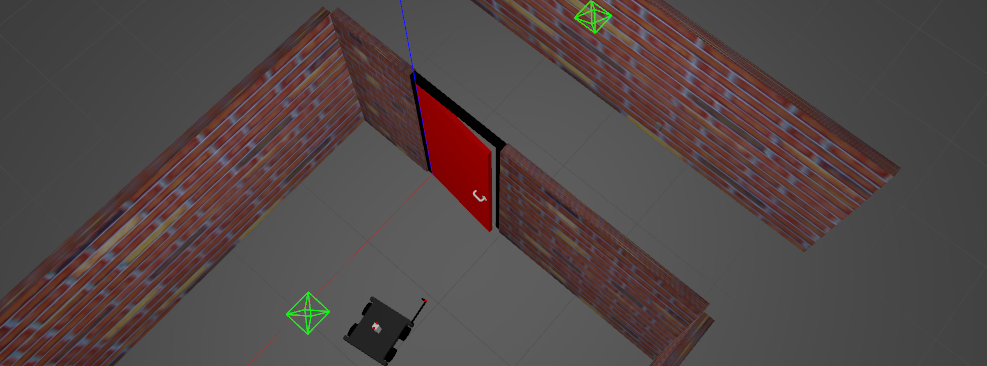
100 test cases with random initial pose of the mobile robot

**Environment Settings**
- door:
  - mass: **20kg**
  - width: 0.9m
  - thickness: 4.5cm
  - height: 2.1m
  - color: **red**
- **door hinge**:
  - spring reference: 3 (number of spring)
  - spring stiffness: 1
- door frame:
  - color: **black**
- door handle:
  - color: white
- wall:
  - color: **bricks**
- **lighting**:
  - one in room: constant = 1
  - one out room: constant = 1
- **wheel-ground friction**: mu1=0.5, mu2=0.5
- camera noise: 0.00

**Test Statistics**
- *single camera*
  - **success rate: 20 / 100**
  - failure case [0, 1, 5, 6, 7, 8, 9, 10, 12, 13, 14, 15, 16, 17, 18, 19, 21, 22, 23, 24, 25, 26, 27, 29, 30, 32, 33, 34, 35, 37, 39, 40, 41, 42, 43, 44, 46, 48, 49, 50, 52, 53, 54, 55, 57, 58, 59, 60, 62, 64, 65, 66, 69, 70, 72, 73, 74, 75, 76, 77, 78, 79, 80, 81, 82, 84, 85, 87, 88, 89, 90, 91, 92, 93, 94, 95, 96, 97, 98, 99]
  - steps: average **17**, minimum 16 [0], maximum 28 [3]
  - average value: average **87.226**, lowest 77.046 [12], highest 97.874 [19]
  - max force: average 221.412, smallest 118.263 [17] largest 439.820 [11]
  - trajectory of the case with least step  

- *multiple cameras*
  - **success rate: 11 / 100**
  - failure case [1, 2, 3, 4, 6, 7, 8, 9, 10, 11, 12, 13, 14, 15, 17, 18, 19, 22, 23, 25, 27, 29, 31, 32, 33, 34, 35, 36, 37, 38, 39, 40, 41, 42, 43, 44, 45, 46, 47, 48, 49, 50, 51, 52, 53, 54, 55, 56, 57, 58, 59, 60, 61, 62, 63, 64, 65, 66, 68, 69, 70, 71, 72, 73, 74, 75, 76, 78, 79, 80, 81, 82, 83, 84, 85, 86, 87, 88, 89, 90, 91, 92, 93, 94, 95, 96, 97, 98, 99]
  - steps: average **13**, minimum 12 [2], maximum 14 [0]
  - average value: average **263.409**, lowest 260.037 [10], highest 267.516 5
  - max force: average 247.133, smallest 86.688 [4] largest 354.034 [5]
  - trajectory of the case with least step  

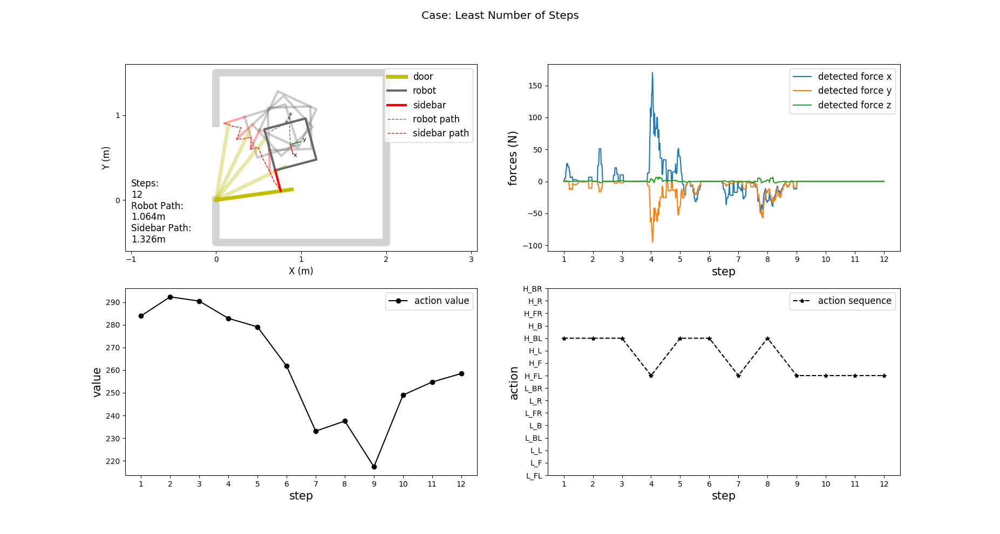
- *force-vision sensor fusion*   
  - **success rate: 100 / 100**
  - failure case []
  - steps: average **12**, minimum 11 [71], maximum 16 [47]
  - average value: average **90.290**, lowest 86.193 [33], highest 96.886 [29]
  - max force: average 164.474, smallest 61.902 [0] largest 672.001 [53]
  - trajectory of the case with least step  

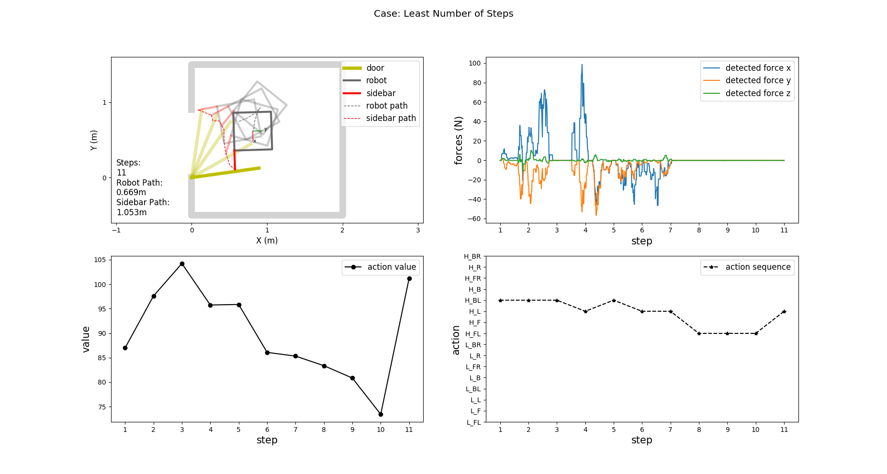

### env 3
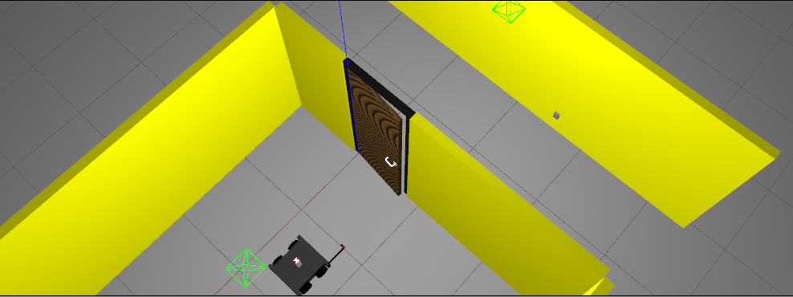
100 test cases with random initial pose of the mobile robot

**Environment Settings**
- door:
  - mass: **15kg**
  - width: **0.75m**
  - thickness: 4.5cm
  - height: 2.1m
  - color: **wood pallet**
- door hinge:
  - spring reference: 2 (number of spring)
  - spring stiffness: 1
- door frame:
  - color: **flat black**
- door handle:
  - color: white
- wall:
  - color: **yellow**
- **lighting**:
  - one in room: constant = 0.5
  - one out room: constant = 0.5
- **wheel-ground friction**: mu1=0.7, mu2=0.98
- camera noise: 0.00

**Test Statistics**
- *single camera*
  - **success rate: 7 / 100**
  - failure case [0, 1, 2, 3, 4, 5, 6, 7, 8, 9, 10, 11, 12, 14, 15, 16, 17, 18, 19, 20, 21, 22, 23, 24, 25, 26, 27, 28, 29, 30, 31, 32, 33, 34, 35, 36, 37, 38, 39, 40, 41, 42, 44, 45, 46, 47, 48, 51, 52, 54, 55, 56, 57, 58, 59, 60, 61, 62, 63, 64, 65, 66, 67, 68, 69, 70, 71, 72, 73, 74, 75, 76, 77, 78, 79, 81, 82, 83, 84, 85, 86, 87, 88, 89, 90, 91, 92, 93, 94, 95, 96, 98, 99]
  - steps: average **14**, minimum 13 [1], maximum 18 [6]
  - average value: average **55.746**, lowest 48.061 [4], highest 65.856 [6]
  - max force: average 163.814, smallest 114.304 [5] largest 234.275 [6]
  - trajectory of the case with least step  

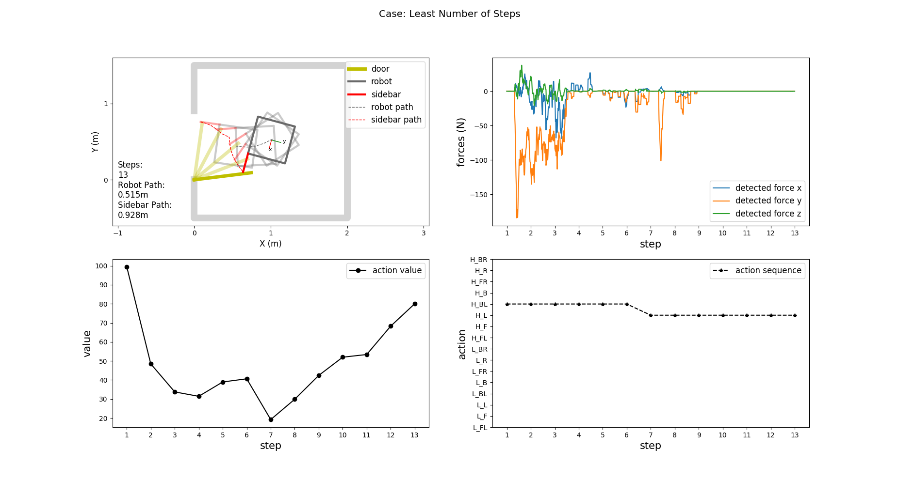
- *multiple cameras*
  - **success rate: 73 / 100**
  - failure case [1, 3, 7, 10, 12, 18, 27, 34, 35, 38, 40, 44, 47, 58, 63, 66, 67, 68, 77, 79, 82, 83, 84, 87, 90, 92, 93]
  - steps: average **12**, minimum 11 [4], maximum 24 [18]
  - average value: average **170.775**, lowest 145.139 [63], highest 195.609 [46]
  - max force: average 243.057, smallest 75.241 [13] largest 791.945 [71]
  - trajectory of the case with least step

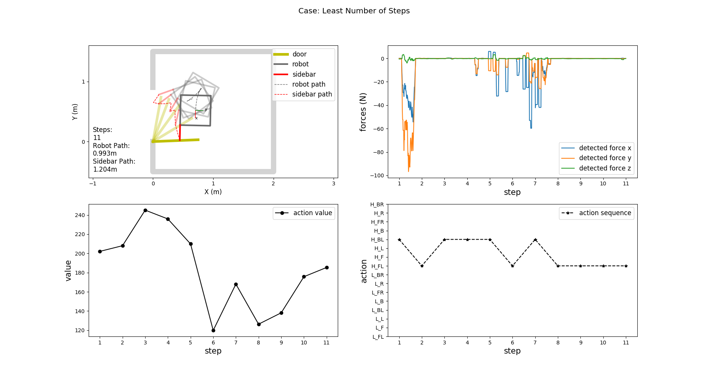
- *force-vision sensor fusion*   
  - **success rate: 100 / 100**
  - failure case []
  - steps: average **11**, minimum 10 [0], maximum 19 [73]
  - average value: average **81.165**, lowest 75.127 [71], highest 86.228 [73]
  - max force: average 205.455, smallest 42.100 [85] largest 699.727 [38]
  - trajectory of the case with least step  

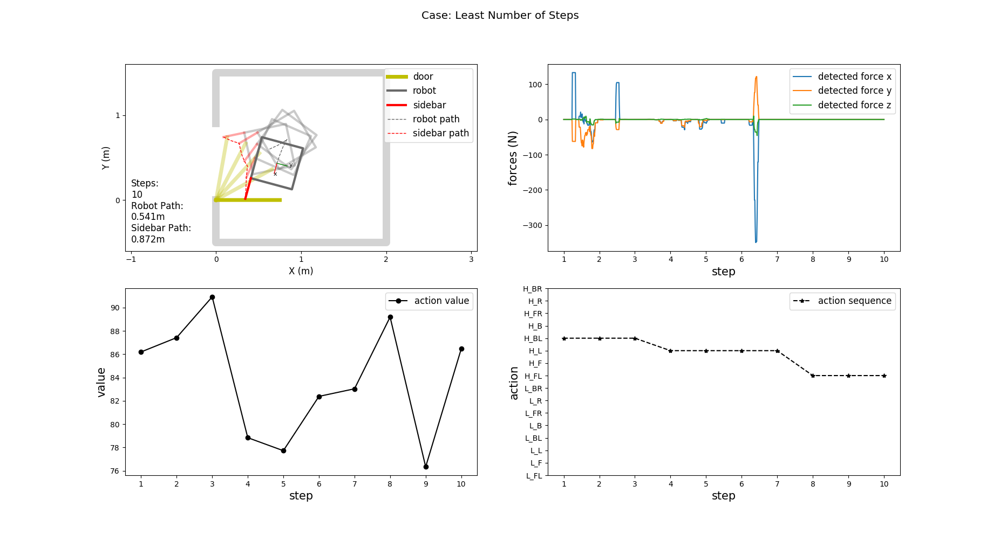

### env 4
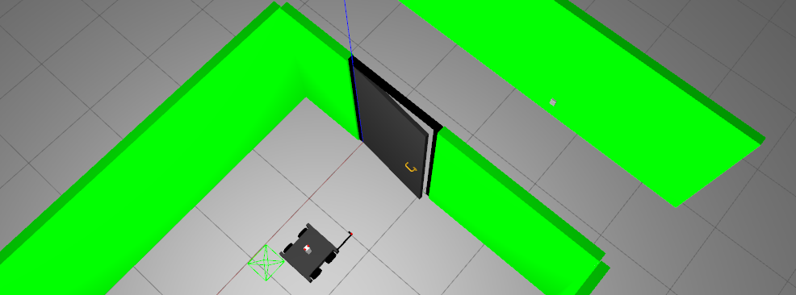
100 test cases with random initial pose of the mobile robot

**Environment Settings**
- door:
  - mass: **30kg**
  - width: **1.05m**
  - thickness: 4.5cm
  - height: 2.1m
  - color: **dark gray**
- **door hinge**:
  - spring reference: 3 (number of spring)
  - spring stiffness: 1
- door frame:
  - color: **black**
- door handle:
  - color: **gold**
- wall:
  - color: **green**
- **lighting**:
  - one in room: constant = 0.2
- **wheel-ground friction**: mu1=0.7, mu2=0.98
- camera noise: 0.00

**Test Statistics**
- *single camera*
  - **success rate: 5 / 100**
  - failure case [0, 1, 2, 3, 4, 5, 6, 7, 8, 9, 10, 11, 12, 13, 15, 16, 17, 18, 19, 20, 21, 22, 23, 24, 25, 26, 27, 28, 29, 30, 31, 32, 33, 34, 35, 36, 37, 38, 39, 40, 41, 42, 43, 44, 45, 46, 47, 48, 49, 50, 51, 52, 53, 54, 55, 56, 58, 59, 60, 61, 62, 63, 64, 65, 66, 67, 68, 69, 70, 71, 72, 73, 74, 75, 77, 78, 79, 80, 81, 82, 84, 85, 86, 87, 88, 89, 90, 91, 92, 93, 95, 96, 97, 98, 99]
  - steps: average **19**, minimum 17 [3], maximum 24 [4]
  - average value: average **78.247**, lowest 65.137 [1], highest 89.616 [0]
  - max force: average 305.611, smallest 196.409 [4] largest 420.931 [0]
  - trajectory of the case with least step

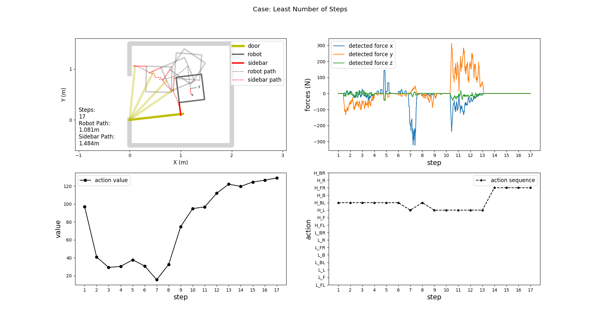
- *multiple cameras*
  - **success rate: 42 / 100**
  - failure case [2, 4, 5, 6, 8, 10, 11, 13, 14, 16, 18, 20, 21, 22, 23, 24, 25, 26, 27, 29, 31, 34, 35, 36, 39, 40, 41, 43, 44, 46, 47, 48, 49, 53, 54, 55, 57, 59, 60, 63, 64, 65, 68, 70, 76, 78, 79, 80, 82, 85, 86, 88, 92, 94, 95, 96, 97, 99]
  - steps: average **19**, minimum 15 [0], maximum 37 [25]
  - average value: average **152.508**, lowest 92.918 [11], highest 189.009 [16]
  - max force: average 186.881, smallest 77.614 [26] largest 558.366 [13]
  - trajectory of the case with least step  

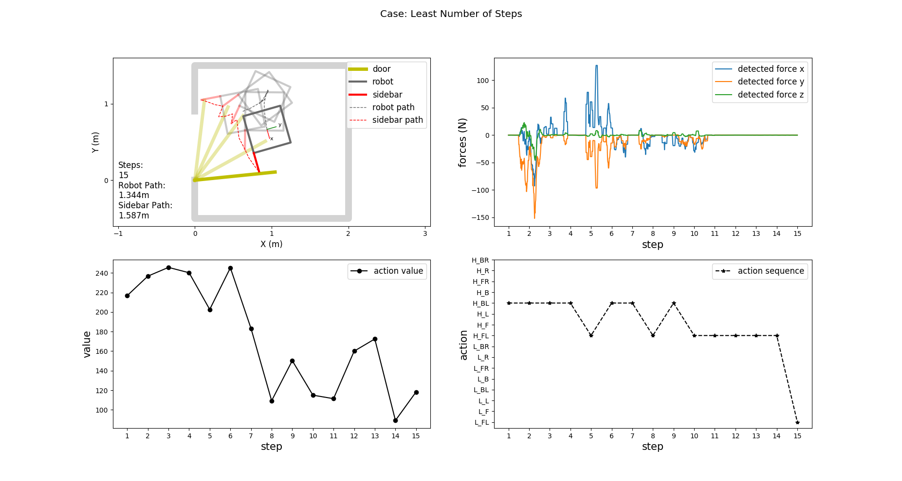
- *force-vision sensor fusion*   
  - **success rate: 83 / 100**
  - failure case []
  - steps: average **15**, minimum 14 [10], maximum 27 [80]
  - average value: average **89.734**, lowest 80.222 [33], highest 90.109 [8]
  - max force: average 156.385, smallest 69.380 [46] largest 347.058 [77]
  - trajectory of the case with least step

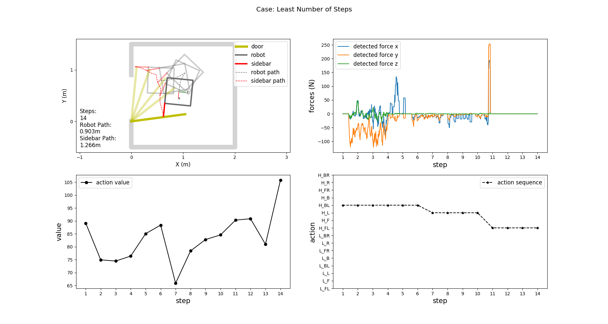

### env 5

100 test cases with random initial pose of the mobile robot

**Environment Settings**
- door:
  - mass: **20kg**
  - width: 0.9m
  - thickness: 4.5cm
  - height: 2.1m
  - color: **red**
- **door hinge**:
  - spring reference: 3 (number of spring)
  - spring stiffness: 1
- door frame:
  - color: **black**
- door handle:
  - color: white
- wall:
  - color: **bricks**
- **lighting**:
  - one in room: constant = 1
  - one out room: constant = 1
- **wheel-ground friction**: mu1=0.7, mu2=0.98
- camera noise: Gaussian noise with variance of 0.02

**Test Statistics**
- *single camera*
  - **success rate: 0 / 100**
- *multiple cameras*
  - **success rate: 0 / 100**
- *force-vision sensor fusion*   
  - **success rate: 53 / 100**
  - failure case [6, 8, 9, 12, 17, 18, 22, 24, 25, 27, 31, 32, 34, 35, 36, 38, 39, 41, 42, 44, 45, 46, 48, 49, 53, 55, 56, 57, 59, 60, 62, 63, 64, 65, 67, 73, 74, 75, 76, 84, 87, 88, 91, 94, 95, 96, 98]
  - steps: average **14**, minimum 12 [0], maximum 36 [23]
  - average value: average **90.206**, lowest 85.573 [46], highest 95.281 [50]
  - max force: average 240.688, smallest 50.582 [35] largest 700.568 [23]
  - trajectory of the case with least step

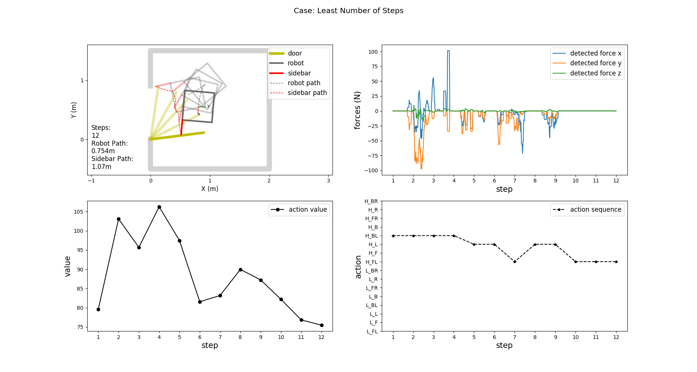
